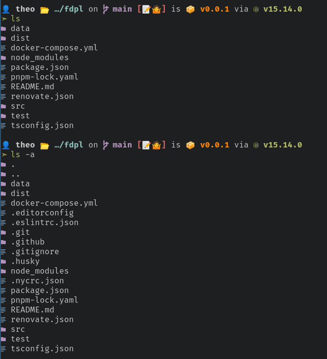

# prett 🚀

Prettier shell commands, inspired by [ptSh](https://github.com/jszczerbinsky/ptSh).



## Prequisites

- A font that is capable of displaying nerd icons.
- CMake, Ninja, And Git
- A shell (eg.zsh, bash)
- A ansi color-compatible terminal (eg. Alacritty).

## Building

```sh
git clone https://github.com/theoparis/prett
cd prett
cmake -B build -G Ninja -DCMAKE_INSTALL_PREFIX=$HOME/.local/bin
cmake --build build
cmake --install build
```

## Usage

Run `prett sub-command`.

### Compatible Commands

- `ls`

## Shell Aliases

You can optionally alias the default commands in your shell to point to the corresponding prett commands.

See [aliases.sh](scripts/aliases.sh).
